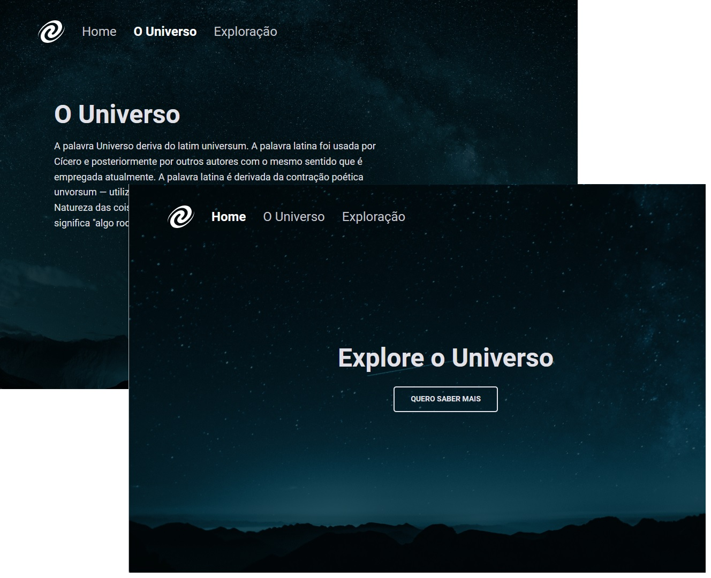

<h1 align="center"> SPA Universe </h1>

O que foi abordado nesse desafio:

- Conceitos de SPA - Single Page Appplication;
- Mapeamento de rotas;
- Assíncrono e promises;
- Orientação a objetos;
- Classes e muito mais.

  

## 🚀 Tecnologias

Esse projeto foi desenvolvido com as seguintes tecnologias:

- HTML e CSS
- JavaScript
- Git e Github
- Figma